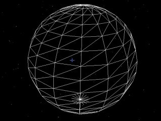

# Geometrik

**Geometrik** is a C++ library that allows you to create easily and dynamically various spheric 3D shapes (meshes).
The **Geometrik** library is designed to work with the Ogre3D Game engine, but can be easily adapted to work with any other C++ environment.
The library offers several classes to create dynamicaly geometric 3D-meshes (like cubes, spheres, ellipsoids...).

The API description is provided in the [Dioxygen pages](https://sphinkie.github.io/Geometrik/html/index.html)
(http://sphinkie.github.io/Geometrik).

## Samples
Here are some 3D objects that you can create with the library:

**Example of wireframe**

**Example of textured shape**

# Credits

This C++ library is based on the theorical and mathematical book _"Geodesic Math & How to Use It"_ by Hugh Kenner, 1976, University of California Press. (ISBN 0-520-02924-0).  

It also refers to the C program of Richard J. Bono (http://mathforum.org/library/view/8321.html)

## Original Licence

	Copyright (C) 1995 - 2002 Richard J. Bono
	This program is free software.
	You can redistribute it and/or modify it under the terms of the GNU General Public License.
	Please direct inquiries, comments and modifications to:
	   Richard J. Bono
	   44 Augusta Rd.
	   Brownsville, TX 78521
	   email: rjbono@applied-synergetics.com

