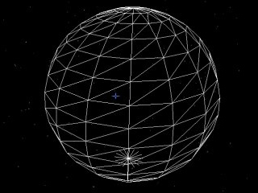
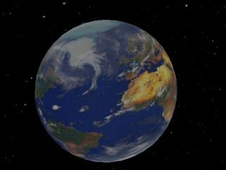

# Geometrik

Geometric libraries for Ogre3D Engine, for easily and dynamically creating various spheric meshes.

API description is provided in the [github pages](Sphinkie.github.io/Geometrik).

## Samples

**Geometrik**

# Credits

Initial creator of Geodesic : Richard J. Bono - GNU licence (1995-2002)  
Reference : http://mathforum.org/library/view/8321.html

## Licence

	Copyright (C) 1995 - 2002 Richard J. Bono
	This program is free software; you can redistribute it and/or modify
	it under the terms of the GNU General Public License.
	 Please direct inquiries, comments and modifications to:
	 Richard J. Bono
	 44 Augusta Rd.
	 Brownsville, TX 78521
	 email: rjbono@applied-synergetics.com

## Acknowledgements & References:
  The main reference used in the creation of this code was 
  _"Geodesic Math & How to Use It"_ by Hugh Kenner, 1976, University of California Press.
  ISBN 0-520-02924-0; Library of Congress Catalog Card Number: 74-27292.  
    
